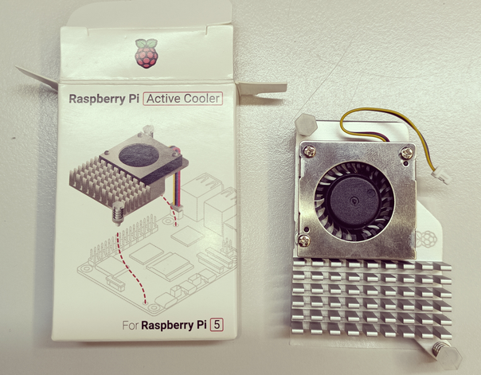

==========================
Prise en main du matériel
==========================

Cette section présente les composants essentiels nécessaires pour configurer un système performant basé sur le Raspberry Pi 5. Chaque élément est choisi pour maximiser les capacités de calcul, de stockage et de refroidissement du système.

.. figure:: img/raspberry.jpg
   :align: center
   :width: 30%

   Carte Raspberry Pi 5

La **carte Raspberry Pi 5** est équipée d’un processeur ARM Cortex-A76 quadricœur cadencé à 2,4 GHz, offrant une augmentation significative des performances par rapport aux générations précédentes. Elle prend en charge jusqu’à 8 Go de RAM LPDDR4X, la rendant idéale pour les applications gourmandes en ressources, comme la robotique ou l'IA.

---

.. figure:: img/disquedur.jpg
   :align: center
   :width: 30%

   Disque dur ADATA

Le **disque dur ADATA Legend 700 NVMe** de 256 Go garantit une vitesse de lecture/écriture pouvant atteindre 2000 Mo/s, idéale pour les systèmes d’exploitation, les bases de données ou les projets nécessitant des temps de chargement rapides. Ce disque SSD compact et performant est compatible avec le port NVMe de la carte base.

---

.. figure:: img/NVMeBase.jpg
   :align: center
   :width: 30%

   Carte base NVMe

La **carte base NVMe** agit comme un adaptateur entre le Raspberry Pi 5 et le disque dur NVMe, assurant une connexion fiable et des performances maximales. Elle inclut un support de montage et des vis pour une installation facile et sécurisée.

---

   Radiateur pour Raspberry

Le **radiateur actif pour Raspberry Pi 5** est équipé d’un ventilateur intégré et de larges ailettes pour une dissipation thermique efficace. Conçu pour les charges de travail prolongées, il maintient les températures du processeur en dessous de 50 °C, garantissant une performance constante sans risque de throttling.

---

* Spécifications des composants :

- **Raspberry Pi 5** :

  - Processeur : ARM Cortex-A76 quadricœur 2,4 GHz.
  - Mémoire : jusqu’à 8 Go LPDDR4X.
  - Connectivité : 2 ports USB 3.0, 2 ports micro-HDMI, Ethernet Gigabit.

- **Disque dur NVMe ADATA Legend 700** :

  - Capacité : 256 Go.
  - Interface : PCIe Gen3 x4.
  - Performances : Lecture/écriture jusqu’à 2000 Mo/s.

- **Carte base NVMe** :

  - Interface : Compatible avec le port PCIe de la Raspberry Pi 5.
  - Accessoires inclus : Support de montage, vis.

- **Radiateur pour Raspberry** :

  - Matériau : Aluminium avec ventilateur intégré.
  - Usage : Dissipation thermique active pour applications intensives.

1. Préparation du matériel
===========================

- **Installer le radiateur sur la Raspberry Pi :**
  
   - Retirer le cache du connecteur JST avant installation.
   - Suivre les instructions fournies dans la `notice d'installation du radiateur <https://datasheets.raspberrypi.com/cooling/raspberry-pi-active-cooler-product-brief.pdf>`_.

.. figure:: img/install_radiateur.jpg
   :align: center
   :width: 30%

   Radiateur installé sur la Raspberry

- **Installer le dissipateur thermique et le disque dur :**
  
    - Retirer l'opercule du dissipateur thermique (lame bleue) et le coller sur le disque dur.
    - Insérer le disque dur dans l'encoche de la carte NVMe BASE Pimoroni (présence d'un détrompeur).
    - Fixer avec une vis de référence (vis-écrou-disque dur-écrou).
    - Installer les 4 entretoises sur la base.
    - Connecter la base à la Raspberry Pi en respectant les sens de branchement.
    - Positionner et visser la Raspberry sur la base.
    - Référez-vous au `support du disque dur Pimoroni <https://learn.pimoroni.com/article/getting-started-with-nvme-base>`_.

.. figure:: img/install_dd.jpg
   :align: center
   :width: 30%

   Installation du disque dur sur la base NVMe

.. figure:: img/assemblage_NVMe.jpg
   :align: center
   :width: 30%

   Assemblage de la Raspberry et de la base NVMe

2. Préparation pour installation de l'OS
========================================

**Préparation initiale :**
 
   * Insérer la carte SD contenant Raspbian dans la Raspberry Pi.
   * Brancher le câble HDMI et l'alimentation, ainsi qu'un clavier et une souris en USB.
   * Si la carte SD est utilisée pour la première fois :
  
       - Configurer les paramètres (langue : français, etc.).
       - Identifiants par défaut : username : `pi`, password : `pi`.
       - Configurer un partage de connexion avec un téléphone pour accéder à Internet.
       - Définir Firefox comme navigateur par défaut, mettre à jour, puis redémarrer.

.. figure:: img/branchement_rasp.jpg
   :align: center
   :width: 30%

   Branchements de la Raspberry

**Installation du système sur le disque NVMe :**
 
    - Ouvrir un terminal et suivre la section *"Installing your OS onto the NVMe SSD"* dans le `guide de support Pimoroni <https://learn.pimoroni.com/article/getting-started-with-nvme-base>`_.
    - À l'étape *"OS Installation Options"*, utiliser l'option 1 : *Install a new OS using Raspberry Pi OS Desktop* avec Raspberry Pi Imager.

**Partitionnement du disque dur :**

    - Installer l'outil GParted : 
    
      .. code-block:: bash

         sudo apt-get install gparted

    - Ouvrir GParted (Menu -> Outil système).
    - Sélectionner en haut à droite : `/dev/nvme0n1`.
    - Créez une table de partition (type : msdos).
    - Définir une nouvelle partition :
  
       - Taille : 122000 (la moitié du disque).
       - Étiquette : nom personnalisé.
  
    - Appliquer toutes les modifications (bouton check vert).
    - Fermer GParted.

.. figure:: img/separation_dd.jpg
   :align: center
   :width: 40%

   Interface de GParted

3. Installation d'Ubuntu et mise en place du système
====================================================

Installation de l'OS
--------------------

    - Utiliser l'Imager pour sélectionner :
  
       - Modèle : Raspberry Pi 5.
       - Système d'exploitation : Ubuntu LTS 24.04 Desktop.
       - Stockage : choisir le groupe créé lors du partitionnement.
  
    - Confirmer les messages d'avertissement (perte de données) et définir un mot de passe.
    - Consulter la `documentation officielle Ubuntu <https://ubuntu.com/tutorials/how-to-install-ubuntu-desktop-on-raspberry-pi-4#2-prepare-the-sd-card>`_ pour plus de détails.

Configuration du système pour ce projet
---------------------------------------

* Pour créer un nouvel utilisateur dans Ubuntu 24.04, suivez les étapes suivantes :

   1. **Connexion à l'utilisateur existant :**

      - Connectez-vous avec l'utilisateur par défaut : **"pi"**.
      - Utilisez le mot de passe associé : **"ros2insa"**.

   2. **Accéder aux paramètres système :**

      - Ouvrez le menu **Settings** (Paramètres).
      - Naviguez jusqu'à la section **System** (Système).
      - Cliquez sur **Users** (Utilisateurs).

   3. **Déverrouiller la gestion des utilisateurs :**

      - Cliquez sur le bouton **Unlock** (Déverrouiller) dans la section des utilisateurs.
      - Saisissez le mot de passe de l'utilisateur actuel (**ros2insa**) pour autoriser les modifications.

   4. **Ajouter un nouvel utilisateur :**

      - En bas de la fenêtre, cliquez sur **Add User...** (Ajouter un utilisateur).
      - Remplissez les informations demandées pour le nouvel utilisateur :
        - Nom complet.
        - Nom d'utilisateur.
        - Mot de passe souhaité.

   5. **Attribuer les privilèges d'administrateur :**

      - Cochez la case **Administrator** (Administrateur) avant de valider.

      .. note:: **Important** : Cette étape garantit que l'utilisateur nouvellement créé dispose des droits nécessaires pour gérer le système.

   6. **Finalisation :**

      - Cliquez sur **Add** (Ajouter) pour finaliser la création de l'utilisateur.
      - Vérifiez que le nouvel utilisateur apparaît dans la liste des utilisateurs et qu’il est bien marqué comme administrateur.

* Installation de VSCode :

   - Ouvrez un terminal et exécutez les commandes suivantes :

     .. code-block:: bash

        sudo apt update
        sudo apt install code

   - Lancez VSCode en tapant ``code`` dans le terminal.
   - Installez les extensions recommandées pour Python et C++.

* Installation de ROS2

   Pour installer ROS2 Jazzy sur un système Ubuntu, suivez les étapes ci-dessous :

   1. **Mettre à jour le cache des dépôts APT :**

      Avant de procéder à l'installation, assurez-vous que votre système dispose des dernières informations sur les paquets disponibles :

      .. code-block:: bash

         sudo apt update

   2. **Installer ROS2 Jazzy :**

      - Cette option installe l'ensemble des outils ROS2, y compris **RViz**, les démos et les tutoriels :

      .. code-block:: bash

         sudo apt install ros-jazzy-desktop

   3. **Installation minimale de ROS2 Jazzy (ROS-Base) :**

      - Cette option installe uniquement les bibliothèques de communication, les paquets de messages et les outils en ligne de commande. Aucun outil graphique n'est inclus :

      .. code-block:: bash

         sudo apt install ros-jazzy-ros-base
