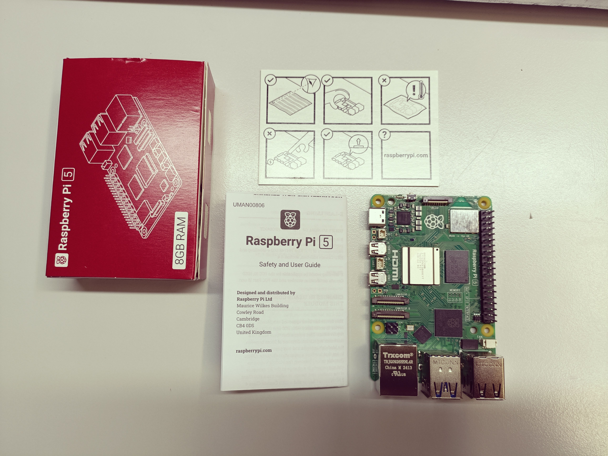

==========================
Prise en main du matériel
==========================

   Carte Raspberry Pi 5

.. figure:: img/disquedur.jpg
   :align: center
   :width: 30%

   Disque dur ADATA

.. figure:: img/NVMeBase.jpg
   :align: center
   :width: 30%

   Carte base NVMe

.. figure:: img/radiateur.jpg
   :align: center
   :width: 30%

   Radiateur pour Raspberry

1. Préparation du matériel
===========================

- **Installer le radiateur sur la Raspberry Pi :**
  
   - Retirer le cache du connecteur JST avant installation.
   - Suivre les instructions fournies dans la `notice d'installation du radiateur <https://datasheets.raspberrypi.com/cooling/raspberry-pi-active-cooler-product-brief.pdf>`_.

.. figure:: img/install_radiateur.jpg
   :align: center
   :width: 30%

   Radiateur installé sur la Raspberry

- **Installer le dissipateur thermique et le disque dur :**
  
    - Retirer l'opercule du dissipateur thermique (lame bleue) et le coller sur le disque dur.
    - Insérer le disque dur dans l'encoche de la carte NVMe BASE Pimoroni (présence d'un détrompeur).
    - Fixer avec une vis de référence (vis-écrou-disque dur-écrou).
    - Installer les 4 entretoises sur la base.
    - Connecter la base à la Raspberry Pi en respectant les sens de branchement.
    - Positionner et visser la Raspberry sur la base.
    - Référez-vous au `support du disque dur Pimoroni <https://learn.pimoroni.com/article/getting-started-with-nvme-base>`_.

.. figure:: img/install_dd.jpg
   :align: center
   :width: 30%

   Installation du disque dur sur la base NVMe

.. figure:: img/assemblage_NVMe.jpg
   :align: center
   :width: 30%

   Assemblage de la Raspberry et de la base NVMe

2. Installer l'OS
=================

**Préparation initiale :**
 
   * Insérer la carte SD contenant Raspbian dans la Raspberry Pi.
   * Brancher le câble HDMI et l'alimentation, ainsi qu'un clavier et une souris en USB.
   * Si la carte SD est utilisée pour la première fois :
  
       - Configurer les paramètres (langue : français, etc.).
       - Identifiants par défaut : username : `pi`, password : `pi`.
       - Configurer un partage de connexion avec un téléphone pour accéder à Internet.
       - Définir Firefox comme navigateur par défaut, mettre à jour, puis redémarrer.

   Branchements de la Raspberry

**Installation du système sur le disque NVMe :**
 
    - Ouvrir un terminal et suivre la section *"Installing your OS onto the NVMe SSD"* dans le `guide de support Pimoroni <https://learn.pimoroni.com/article/getting-started-with-nvme-base>`_.
    - À l'étape *"OS Installation Options"*, utiliser l'option 1 : *Install a new OS using Raspberry Pi OS Desktop* avec Raspberry Pi Imager.

**Partitionnement du disque dur :**

    - Installer l'outil GParted : ``sudo apt-get install gparted``.
    - Ouvrir GParted (Menu -> Outil système).
    - Sélectionner en haut à droite : `/dev/nvme0n1`.
    - Créez une table de partition (type : msdos).
    - Définir une nouvelle partition :
  
       - Taille : 122000 (la moitié du disque).
       - Étiquette : nom personnalisé.
  
    - Appliquer toutes les modifications (bouton check vert).
    - Fermer GParted.

.. figure:: img/separation_dd.jpg
   :align: center
   :width: 40%

   Interface de GParted

**Installer Ubuntu LTS 24.04 :**

    - Utiliser l'Imager pour sélectionner :
  
       - Modèle : Raspberry Pi 5.
       - Système d'exploitation : Ubuntu LTS 24.04 Desktop.
       - Stockage : choisir le groupe créé lors du partitionnement.
  
    - Confirmer les messages d'avertissement (perte de données) et définir un mot de passe.
    - Consulter la `documentation officielle Ubuntu <https://ubuntu.com/tutorials/how-to-install-ubuntu-desktop-on-raspberry-pi-4#2-prepare-the-sd-card>`_ pour plus de détails.

3. Installer ROS2
=================

A COMPLETER

4. Outils
=========

**Captures d'écran :**
 Utiliser le logiciel Shutter : ``sudo apt-get install shutter``.

**Utilisation de GitHub :**

   - Après avoir créé le dépôt, visualisez la documentation via :
  
     - Le projet -> Actions -> *Page Build and Deployment* -> *Deploy*.
     - Ou bien via : Le projet -> *Settings* -> *Pages*.

  - Pour mettre à jour un fork déjà réalisé :
  
     - Vérifier si il y a un upstream -> git remote -v
     - Si aucun upstream est présent, il faut le créer : git remote add upstream git@github.com:yguel/informatique_industrielle_avec_ROS2.git
     - Ensuite il faut récupérer sur cette branche les nouvelles données : git fetch upstream
     - Pour conclure, il faut rebase la nouvelle branche vers la notre (rolling dans notre cas) -> git rebase upstream/rolling
     - Pour obtenir les nouvelles données, il suffit de pull. Pour spécifier comment réconcilier les branches : git config pull.rebase true, puis git pull
  
  